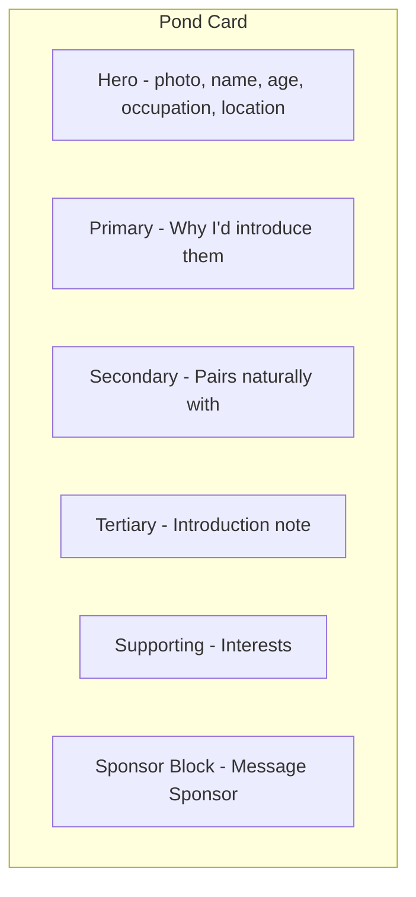

# Pond Page PondView Structure

## Scope

**Target:** Pond page at `/pond` ([pond/page.tsx](src/app/pond/page.tsx)) — the grid of cards where sponsors browse singles.

**Explicitly out of scope:** Single profile page at `/profile/[id]` — no changes.

---

## Current Pond Card Structure

Each card currently shows (top to bottom):
1. Photo with gradient overlay
2. Name + age + interest chips (in overlay)
3. Endorsement caption ("X says: ...")
4. Footer: sponsor avatar, name, Message Sponsor button

---

## New Pond Card Structure (PondView Hierarchy)

---

## Implementation Plan

### 1. Ensure API Returns Required Fields

**File:** [src/app/api/profiles/pond/route.ts](src/app/api/profiles/pond/route.ts)

The pond API uses `profile_with_interests` which selects `p.*` from profiles. Verify that `pairings_signal`, `introduction_signal`, `occupation`, `city`, `state`, `zip_code` are included. If the view's GROUP BY omits newer columns, add a migration or use a direct profiles query.

---

### 2. Hero Section (Card Top)

**Source:** `photos[0]`, `name`, `birth_year`, `occupation`, `city`, `state`

**Changes:**
- Keep single primary photo (no carousel on cards)
- Identity overlay: name, age (computed from birth_year)
- Add occupation and location (city, state) to overlay when present
- **Move interest chips out of hero** — they go to Supporting section below
- Optional: photo counter pill "1 / N" if profile has multiple photos (tap could link to full profile)

**File:** [pond/page.tsx](src/app/pond/page.tsx) (card render, ~lines 752–800)

---

### 3. Primary Anchor: "Why I'd introduce them"

**Source:** `matchmakr_endorsement`

**Changes:**
- Restyle as recommendation-style block: subtle border, background, quote styling
- Heading: "Why I'd introduce them" (or keep "X says:" with stronger framing)
- Sponsor attribution always visible (fallback "Sponsor")
- 1–3 sentences; truncate with "More..." if > 140 chars
- Highest visual weight after hero

**File:** [pond/page.tsx](src/app/pond/page.tsx)

---

### 4. Secondary: "Pairs naturally with"

**Source:** `pairings_signal` (JSONB: `{ quality_ids: string[], custom_quality?: string }`)

**Changes:**
- Parse `pairings_signal` and resolve quality labels via `getPairingQualityById` from [lib/pairings.ts](src/lib/pairings.ts)
- Display as concise trait chips
- Add sublabel: "Best matched by vibe + communication style"
- Visually lighter than endorsement
- Hide section if pairings_signal is empty

**File:** [pond/page.tsx](src/app/pond/page.tsx)

---

### 5. Tertiary: "Introduction note"

**Source:** `introduction_signal` (JSONB: `{ prompt_text: string, response: string }`)

**Changes:**
- Render as single sentence: `prompt_text` with `___` replaced by `response`
- Lower visual weight (smaller text)
- Truncate if response > ~140 chars with "Show more" or "..." (card links to profile for full view)
- Hide if empty

**File:** [pond/page.tsx](src/app/pond/page.tsx)

---

### 6. Supporting: Interests

**Source:** `interests` (from API)

**Changes:**
- Move from hero overlay to dedicated section below introduction note
- De-emphasized chip styling (lighter than pairings)
- Keep first 3–6 chips; subordinate to pairings in visual hierarchy
- Hide if empty

**File:** [pond/page.tsx](src/app/pond/page.tsx)

---

### 7. Sponsor Block (Sticky Conclusion)

**Source:** `sponsor_name`, `sponsor_photo_url`, `sponsored_by_id`

**Changes:**
- Visually separated: top border + padding
- "Message Sponsor" as primary CTA (consider primary-blue button for prominence)
- Sponsor name and avatar remain prominent
- Non-collapsible

**File:** [pond/page.tsx](src/app/pond/page.tsx)

---

## Card Layout Order (Top to Bottom)

| Order | Section | Data |
|-------|---------|------|
| 1 | Hero | Photo, name, age, occupation, city/state |
| 2 | Primary | matchmakr_endorsement |
| 3 | Secondary | pairings_signal |
| 4 | Tertiary | introduction_signal |
| 5 | Supporting | interests |
| 6 | Sponsor Block | sponsor avatar, name, Message Sponsor |

---

## Files to Modify

| File | Changes |
|------|---------|
| [pond/page.tsx](src/app/pond/page.tsx) | Restructure card layout, add pairings + introduction sections, reorder interests |
| [api/profiles/pond/route.ts](src/app/api/profiles/pond/route.ts) | Verify pairings_signal, introduction_signal, occupation, city, state are returned |

---

## Success Criteria

After ~30 seconds browsing the pond, a sponsor should be able to answer (from the cards alone):
1. Why would I introduce this person?
2. Who would they pair well with?
3. Can I imagine the introduction moment?

---

## Explicit Non-Goals

- No changes to profile page
- No new profile fields
- No edit affordances on pond cards (read-only; edit on profile)
- No gamification or engagement mechanics
- Bio: do not display
